# Proyecto Integrador M5  
## Despliegue de Proyecto Modelo de Riesgo Crediticio

## 1. Introducción

Este proyecto tiene como objetivo desarrollar un sistema completo de Machine Learning orientado a la predicción de riesgo crediticio, integrando todas las etapas del ciclo de vida del modelo bajo un enfoque MLOps.

Se abordan desde la exploración de datos hasta el despliegue del modelo en un entorno productivo mediante contenedores Docker, incluyendo monitoreo de desempeño y detección de desviaciones en los datos.

El propósito es construir una solución reproducible, escalable y alineada con buenas prácticas de ciencia de datos y producción.

## 2. Estructura del Proyecto

ProyectoM5_HammerZaldua/
│
├── mlops_pipeline/
│   └── src/
│       ├── Cargar_datos.ipynb
│       ├── comprension_eda.ipynb
│       ├── ft_engineering.py
│       ├── model_training_evaluation.py
│       ├── model_monitoring.py
│       ├── model_deploy.py
│
├── Base_de_datos.xlsx
├── requirements.txt
├── Dockerfile
├── .dockerignore
├── README.md
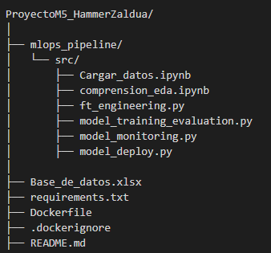
## 3. Avance 1: Carga y Exploración de Datos (EDA)

El objetivo de esta fase fue comprender la estructura, calidad y comportamiento del dataset.

Se trabajó con un conjunto de datos de 10,763 registros y 23 variables relacionadas con información financiera de clientes.

En el archivo Cargar_datos.ipynb se realizó la carga inicial del dataset y una inspección básica mediante funciones como head(), info() y describe(), permitiendo identificar tipos de datos, valores nulos y estructura general.

En el archivo comprension_eda.ipynb se desarrolló un análisis exploratorio profundo dividido en tres niveles:

Análisis univariado, donde se evaluaron distribuciones individuales de variables como edad, salario y capital prestado, identificando presencia de outliers y distribuciones sesgadas.

Análisis bivariado, donde se exploró la relación entre variables independientes y la variable objetivo, evidenciando que clientes con mayor carga financiera presentan mayor riesgo.

Análisis multivariado, utilizando matriz de correlación y gráficos de dispersión para identificar relaciones entre variables.

Uno de los hallazgos más importantes fue el desbalance de clases en la variable objetivo.

### Desbalance de clases

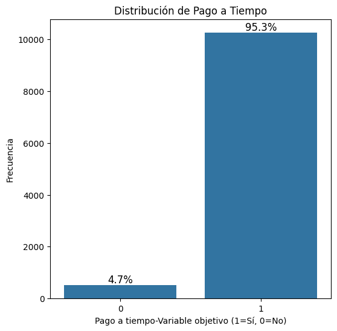

En el dataset se evidencia una distribución altamente desbalanceada:

Clase 1 (pago a tiempo): 95.3%
Clase 0 (no pago): 4.7%

Esto indica que el problema está dominado por la clase mayoritaria, lo cual introduce múltiples dificultades en el modelado. Los modelos ajustan la frontera hacia la clase mayoritaria: La clase minoritaria queda mal representada y el modelo no aprende bien sus patrones.
Problema principal: Sesgo del modelo
Los modelos de Machine Learning aprenden patrones dominantes.
En este caso: El modelo aprende: “casi todos pagan”, Entonces predice siempre 1
lo que generará un Accuracy alta (≈95%) Pero modelo inútil para el negocio.

### Matriz de correlación

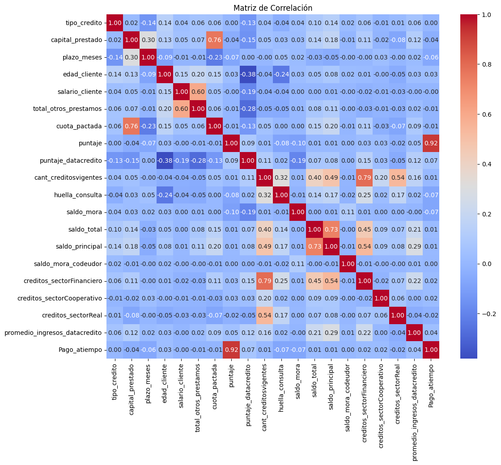
- La matriz de correlación permite identificar relaciones lineales entre las variables del dataset, siendo una herramienta clave para detectar redundancias, multicolinealidad y posibles problemas de data leakage. En este caso, se observan correlaciones altas entre variables financieras como capital_prestado y cuota_pactada (~0.76), así como entre saldo_total y saldo_principal (~0.73), lo cual sugiere que estas variables contienen información similar y podrían estar introduciendo redundancia en el modelo.
el hallazgo más crítico es la alta correlación entre puntaje y la variable objetivo Pago_atiempo (~0.92), lo que indica un claro caso de data leakage. Esto significa que dicha variable contiene información directa o indirecta del resultado que se desea predecir, lo cual explicaría por qué en fases iniciales el modelo alcanzaba métricas artificialmente perfectas. La eliminación de estas variables fue fundamental para obtener un modelo más realista y generalizable.
### Pairplot

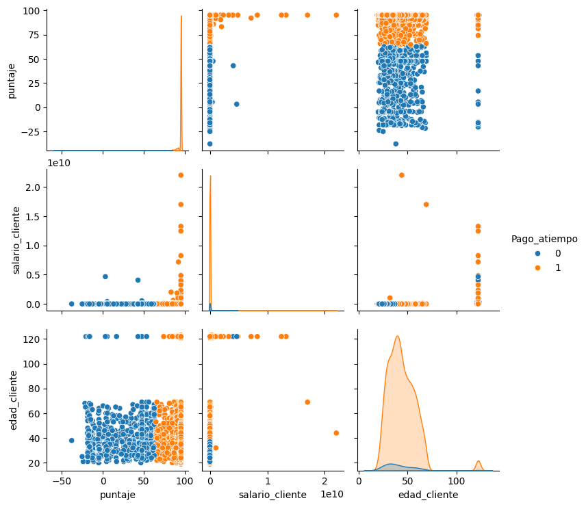

El pairplot permite analizar simultáneamente la distribución y relación entre múltiples variables, diferenciando las clases de la variable objetivo. En este caso, se observa que variables como puntaje presentan cierta separación entre clases, donde valores altos tienden a asociarse con clientes que sí pagan (clase 1), mientras que valores más bajos o dispersos se relacionan con la clase 0. Sin embargo, esta separación no es completamente clara ni lineal, lo que indica que el problema no es trivialmente separable.

Por otro lado, variables como salario_cliente muestran una alta dispersión y presencia de valores extremos (outliers), lo que puede afectar la estabilidad del modelo. Asimismo, en variables como edad_cliente se observa una fuerte superposición entre clases, lo que sugiere que por sí sola no tiene un alto poder predictivo. En conjunto, el pairplot evidencia que el modelo necesita capturar relaciones no lineales y combinaciones de variables, lo cual justifica el uso de algoritmos como XGBoost frente a modelos lineales simples.

## 4. Avance 2: Ingeniería de Características y Modelado

En esta fase se prepararon los datos para el modelado, eliminando ruido y generando nuevas variables.

En ft_engineering.py se implementaron procesos de limpieza como eliminación de duplicados, manejo de valores extremos y eliminación de variables con data leakage.

🔹 Variables eliminadas (Data Leakage)

Se eliminaron variables altamente correlacionadas con la variable objetivo o provenientes de fuentes externas que contienen información futura:

puntaje
puntaje_datacredito
promedio_ingresos_datacredito

Estas variables introducían información que no estaría disponible en un escenario real al momento de predecir, lo que inflaba artificialmente el desempeño del modelo.

🔹 Tratamiento de variables

Se aplicaron diferentes estrategias según el tipo de variable:

Variables numéricas
Clipping de outliers:
salario_cliente → limitado a un rango razonable (0 a 1e8)
puntaje → limitado a valores positivos
Imputación:
Uso de la mediana para valores faltantes
Escalamiento implícito:
No necesario en modelos basados en árboles
Variables categóricas
Transformadas mediante OneHotEncoding
Manejo de valores nulos con categoría más frecuente

🔹 Creación de variables (Feature Engineering)

Se generaron variables derivadas que capturan mejor la capacidad financiera del cliente:

ratio_cuota_ingreso
ratio_deuda_ingreso

Estas variables aportan contexto más relevante que las variables originales por separado.

**Modelos Utilizados y Resultados**
En model_training_evaluation.py se entrenaron modelos como RandomForest y XGBoost.

* Random Forest

Características:

Modelo basado en árboles de decisión
Robusto ante outliers

Resultados observados:

Accuracy alta (~95%) debido al desbalance
Recall muy bajo para clase minoritaria (≈ 0.03)
Tendencia a predecir siempre la clase mayoritaria

Limitación principal:

No logra capturar correctamente los casos de riesgo
* XGBoost

Características:

Modelo de boosting (aprendizaje secuencial)
Captura relaciones no lineales
Mayor capacidad de generalización

Resultados observados:

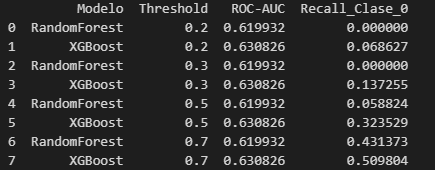

ROC-AUC ligeramente superior a RandomForest (~0.63)
Mejor manejo de relaciones complejas

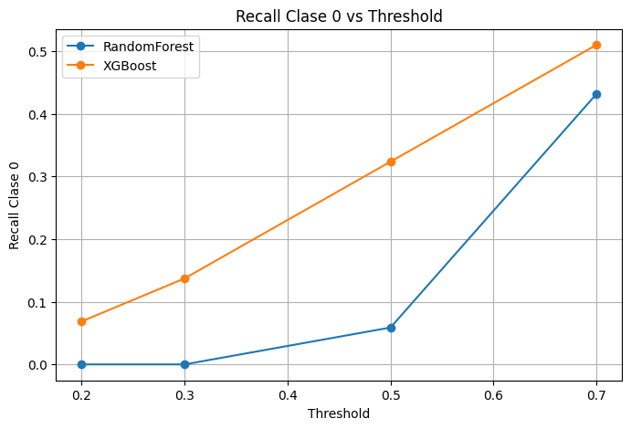

Sin embargo, sigue afectado por el desbalance de clases - Hallazgos como:La eliminación de data leakage redujo el desempeño aparente del modelo, pero lo hizo más realista se prefirio tomar dicha alternativa y ajustar desempeño con threshold determinando valores mayores a 0.5 prediciones mas acertadas a clientes morosos.Threshold bajo (0.2):↑ Recall (detecta más riesgo)↓ Precision (más falsos positivos) y en Threshold alto (0.7):↓ Recall ↑ Precision

El desbalance de clases es el principal limitante del modelo
Las variables financieras (deuda, ingreso, cuota) son las más relevantes
Los modelos tienen dificultad para identificar la clase minoritaria

### Importancia de variables

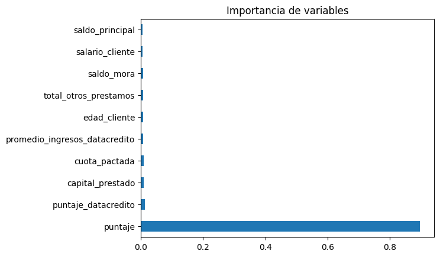

- El análisis de importancia de variables evidencia que la variable puntaje domina de forma significativa la predicción del modelo, con una contribución muy superior al resto de variables. Esto indica que el modelo depende en gran medida de esta característica para tomar decisiones, lo cual es una señal clara de que contiene información altamente predictiva.

Sin embargo, esta alta relevancia también confirma un problema crítico identificado previamente: la presencia de data leakage. La fuerte relación entre puntaje y la variable objetivo implica que el modelo estaba aprendiendo información directa del resultado, lo que generaba métricas artificialmente elevadas. Por esta razón, en etapas posteriores del proyecto se tomó la decisión de eliminar esta variable para garantizar un modelo más realista, robusto y aplicable en producción.
Conclusión Técnica

El análisis de importancia de variables, junto con el proceso de ingeniería de características, demuestra que:

La calidad de las variables es más importante que la cantidad
Eliminar leakage es crítico para modelos confiables
El modelo necesita mejoras adicionales para tratar el desbalance (no abordado en esta fase)
Se implementó un pipeline utilizando ColumnTransformer y Pipeline.

## 5. Avance 3: Monitoreo y Data Drift

El archivo model_monitoring.py implementa un sistema de monitoreo utilizando métricas como KS, PSI, Jensen-Shannon y Chi-cuadrado.

Se desarrolló una aplicación en Streamlit que permite visualizar estas métricas ver:
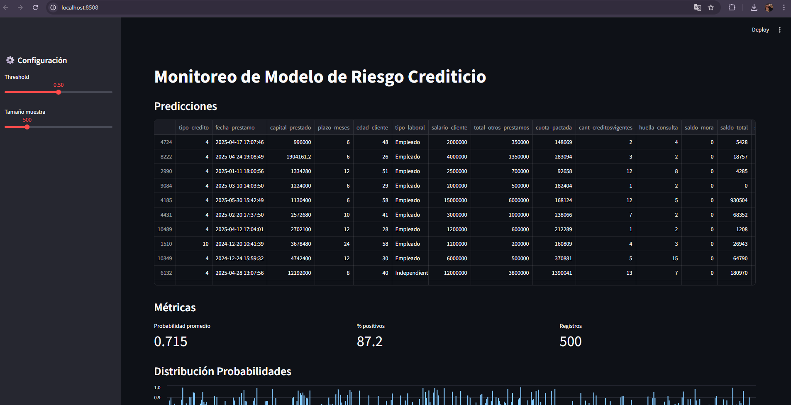
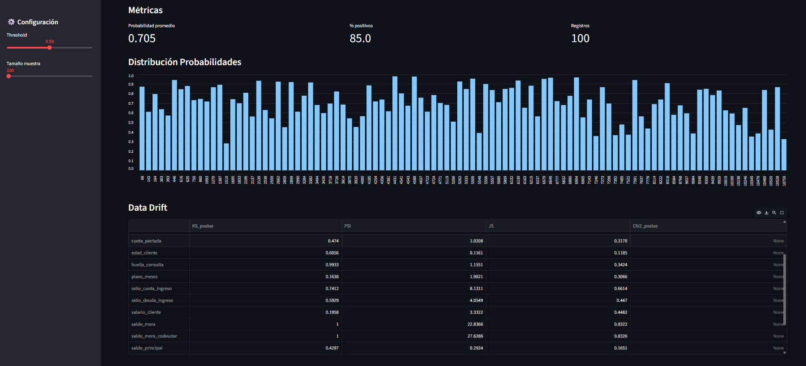
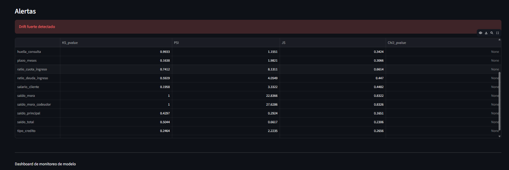

El avance de monitoreo se implementó mediante una aplicación interactiva en Streamlit, diseñada para evaluar en tiempo real el comportamiento del modelo de riesgo crediticio. El dashboard integra tres componentes principales: una tabla de predicciones generadas por el modelo, métricas agregadas (probabilidad promedio, porcentaje de positivos y número de registros analizados) y la distribución de probabilidades. Estas visualizaciones permiten entender cómo el modelo está clasificando a los clientes en un contexto operativo, evidenciando por ejemplo la concentración de probabilidades altas que puede estar asociada al desbalance del dataset o a la configuración del threshold.

En cuanto al monitoreo de data drift, el sistema calcula métricas estadísticas clave como PSI (Population Stability Index), KS (Kolmogorov-Smirnov), Jensen-Shannon (JS) y Chi-cuadrado para variables categóricas. A través de la tabla de drift, se identifican variables con cambios significativos en su distribución respecto a los datos de entrenamiento. Valores elevados de PSI (por ejemplo > 0.2) evidencian un cambio fuerte en la población, lo cual puede comprometer el desempeño del modelo. En el dashboard se destacan alertas automáticas cuando se detecta drift relevante, permitiendo una rápida interpretación y facilitando la toma de decisiones sobre reentrenamiento o ajuste del modelo.

Finalmente, este módulo cumple una función crítica dentro del pipeline de MLOps, ya que permite pasar de un modelo estático a un sistema monitoreado en producción. La integración con Streamlit facilita la exploración visual de los resultados y el seguimiento continuo del modelo. Este enfoque asegura que cualquier cambio en los datos (como variaciones en ingresos, deuda o comportamiento crediticio) sea detectado oportunamente, reduciendo el riesgo de degradación del modelo y mejorando la confiabilidad del sistema en escenarios reales.

**Cómo ejecutar el monitoreo en Streamlit**

Ubícate en la raíz del proyecto y ejecuta en la terminal:
-streamlit run mlops_pipeline/src/model_monitoring.py
Resultado esperado:
Se abrirá automáticamente en el navegador:
http://localhost:8501

## 6. Avance 4: Despliegue del Modelo como servicio (API + Docker)
El despliegue del modelo constituye la etapa donde la solución analítica se convierte en un activo operativo. En este proyecto, el modelo entrenado (XGBoost) fue serializado mediante joblib y expuesto a través de una API desarrollada con FastAPI, permitiendo consumir predicciones de forma estandarizada mediante solicitudes HTTP. Este enfoque desacopla el modelo del entorno de desarrollo, facilitando su integración con otros sistemas como plataformas de originación de crédito, motores de decisión o procesos batch de evaluación masiva.

La API implementada incluye un endpoint /predict capaz de recibir múltiples registros (predicción por lotes), procesarlos utilizando el pipeline de preprocesamiento y retornar probabilidades junto con la clasificación final basada en un threshold configurable. Esto es clave desde negocio, ya que permite adaptar la sensibilidad del modelo según la estrategia de riesgo (más conservadora o más flexible). Además, la arquitectura asegura que los datos de entrada pasen exactamente por las mismas transformaciones utilizadas en entrenamiento, evitando inconsistencias entre entrenamiento y producción, uno de los errores más comunes en proyectos de Machine Learning.

Para garantizar portabilidad y reproducibilidad, el servicio fue empaquetado en una imagen Docker. Esta imagen contiene el código, las dependencias (requirements.txt) y el servidor de aplicación (Uvicorn), permitiendo ejecutar el modelo en cualquier entorno sin conflictos de configuración. Desde una perspectiva empresarial, esto reduce significativamente los problemas de despliegue, facilita la escalabilidad y habilita la integración en arquitecturas modernas basadas en contenedores o microservicios. Además, el uso de Docker permite versionar el modelo junto con su entorno, asegurando trazabilidad y control sobre cambios en producción.

Un aspecto relevante es la conexión implícita entre despliegue y monitoreo. El modelo desplegado no es estático: su desempeño depende de la estabilidad de los datos de entrada. Por ello, el módulo de monitoreo desarrollado en paralelo (Streamlit) complementa el despliegue al permitir detectar desviaciones en la distribución de los datos (data drift). En un entorno real, esta integración habilita un ciclo continuo donde el modelo es evaluado, monitoreado y eventualmente reentrenado, alineándose con prácticas modernas de MLOps.

Desde el punto de vista del negocio, este avance permite automatizar la evaluación de riesgo crediticio, reduciendo tiempos de respuesta y estandarizando criterios de decisión. Sin embargo, también introduce la necesidad de gobernanza: definir thresholds adecuados, monitorear el desempeño y establecer políticas de actualización del modelo. En este sentido, el despliegue no solo representa una solución técnica, sino un componente estratégico dentro del proceso de toma de decisiones financieras.
## 6.1 implementación e imagenes
El archivo model_deploy.py expone el modelo como API usando FastAPI.
Se creó un endpoint /predict que permite predicciones por lote.
Se utilizó Docker para empaquetar la aplicación.
en la terminal se implementa para su ejecución:
- docker build -t modelo-riesgo .
- docker run -p 8000:8000 modelo-riesgo
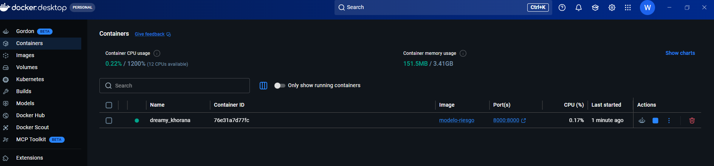
Swagger disponible en:
http://localhost:8000/docs
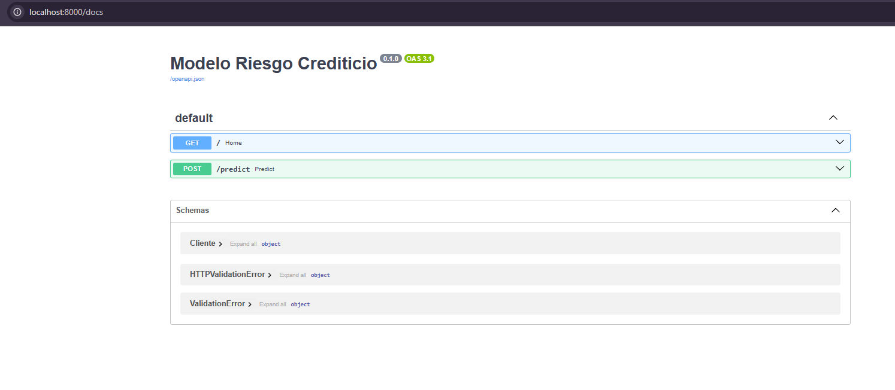
## 7. Conclusión de negocio - Modelo riesgo crediticio
El proyecto evidencia que la principal limitación del modelo no es técnica sino estructural: la fuerte desproporción entre clientes que pagan y los que no (≈95% vs 5%) condiciona el aprendizaje y genera modelos con alta precisión global pero baja capacidad para identificar el riesgo real. Desde el punto de vista de negocio, esto implica que un modelo aparentemente “bueno” puede estar fallando en el objetivo crítico: detectar clientes con probabilidad de incumplimiento. Por tanto, la métrica relevante no es el accuracy, sino la capacidad de capturar la clase minoritaria (recall de riesgo), ya que cada error en este segmento representa pérdidas financieras directas.

El análisis de variables permitió identificar que el comportamiento crediticio está altamente influenciado por factores relacionados con capacidad de pago y endeudamiento (cuota, ingresos, ratios financieros), mientras que variables externas o derivadas como puntajes crediticios pueden introducir sesgos o fuga de información si no se manejan adecuadamente. La eliminación de estas variables (data leakage) redujo el desempeño aparente del modelo, pero generó una solución más realista y aplicable en producción. Esto demuestra que en entornos reales la calidad y origen de los datos es más importante que el algoritmo utilizado, y que la trazabilidad de la información es clave para modelos confiables.

Desde la perspectiva operativa, el ajuste de threshold se convierte en una herramienta estratégica. Reducir el threshold permite aumentar la detección de clientes riesgosos (mayor recall), aunque a costa de incrementar falsos positivos. En términos de negocio, esto se traduce en una decisión entre ser más conservador (rechazar más clientes potencialmente buenos) o asumir mayor riesgo (otorgar crédito a perfiles dudosos). Este equilibrio debe definirse según la política de riesgo de la organización, demostrando que el modelo no es una solución aislada, sino un apoyo a la toma de decisiones.

El módulo de monitoreo implementado con Streamlit aporta un valor clave al proyecto al permitir la detección temprana de cambios en la población (data drift). Se identificaron variables con cambios significativos en su distribución, lo cual puede afectar el desempeño del modelo si no se gestiona adecuadamente. Desde negocio, esto implica que el comportamiento de los clientes no es estático y que el modelo debe ser supervisado continuamente. La capacidad de generar alertas de drift permite anticipar degradaciones del modelo y definir estrategias de reentrenamiento, asegurando su vigencia en el tiempo.

Finalmente, el despliegue del modelo mediante una API y su contenedorización con Docker posiciona la solución en un contexto real de uso. Esto permite integrar el modelo en sistemas productivos y automatizar la evaluación de clientes en procesos batch o en tiempo real. En conjunto, el proyecto demuestra un ciclo completo de MLOps, donde no solo se construye un modelo predictivo, sino que se garantiza su operación, monitoreo y evolución continua, alineando la analítica avanzada con necesidades reales del negocio financiero. 
- El proyecto implementa un pipeline completo de MLOps desde datos hasta despliegue.

## 8. Tecnologías

Python, Pandas, Scikit-learn, XGBoost, FastAPI, Streamlit, Docker, GitHub
